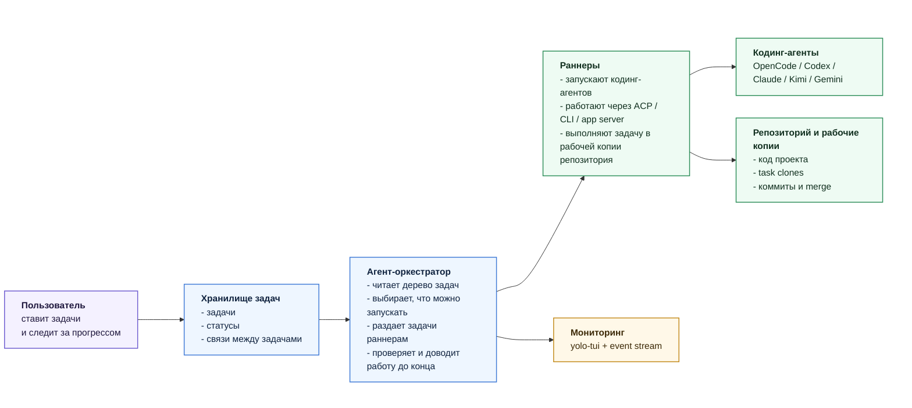

# Top-Level Architecture

This version is simplified for presentation slides.

```mermaid
%%{init: {'flowchart': {'htmlLabels': true, 'curve': 'basis', 'nodeSpacing': 40, 'rankSpacing': 55}} }%%
flowchart LR
  User["<div align='left'><b>Пользователь</b><br/>ставит задачи<br/>и следит за прогрессом</div>"]

  subgraph MainPath[" "]
    direction TB
    Storage["<div align='left'><b>Хранилище задач</b><br/>- задачи<br/>- статусы<br/>- связи между задачами</div>"]
    Orchestrator["<div align='left'><b>Агент-оркестратор</b><br/>- читает дерево задач<br/>- выбирает, что можно запускать<br/>- раздает задачи раннерам<br/>- проверяет и доводит работу до конца</div>"]
    Monitor["<div align='left'><b>Мониторинг</b><br/>yolo-tui + event stream</div>"]

    Storage --> Orchestrator --> Monitor
  end

  subgraph ExecutionPath[" "]
    direction TB
    Runners["<div align='left'><b>Раннеры</b><br/>- запускают кодинг-агентов<br/>- работают через ACP / CLI / app server<br/>- выполняют задачу в рабочей копии репозитория</div>"]
    Agents["<div align='left'><b>Кодинг-агенты</b><br/>OpenCode / Codex / Claude / Kimi / Gemini</div>"]
    Repo["<div align='left'><b>Репозиторий и рабочие копии</b><br/>- код проекта<br/>- task clones<br/>- коммиты и merge</div>"]

    Runners --> Agents
    Runners --> Repo
  end

  User --> Storage
  Orchestrator --> Runners

  classDef user fill:#f4f1ff,stroke:#6d5bd0,stroke-width:1.5px,color:#1f183d;
  classDef core fill:#eef6ff,stroke:#3f7ad6,stroke-width:1.5px,color:#10233f;
  classDef runtime fill:#eefbf3,stroke:#2f8f5b,stroke-width:1.5px,color:#123020;
  classDef support fill:#fff8e8,stroke:#c38a1b,stroke-width:1.5px,color:#3d2a08;

  class User user;
  class Storage,Orchestrator core;
  class Runners,Agents,Repo runtime;
  class Monitor support;
  style MainPath fill:transparent,stroke:transparent;
  style ExecutionPath fill:transparent,stroke:transparent;
```
