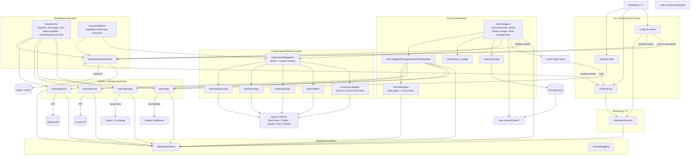

# Architecture

This diagram reflects the current repository after removing the legacy `yolo-runner` compatibility stack.

```mermaid
flowchart TB
  User["Developer / CI"]
  GitRepo[(Git repository)]
  RepoConfig[".yolo-runner/config.yaml"]
  TaskClones[".yolo-runner/clones/*"]
  EventLogs["runner-logs/*.jsonl"]
  TicketFiles[".tickets/ markdown"]
  BeadsState[".beads / br storage"]
  GitHubAPI[(GitHub API)]
  LinearAPI[(Linear API)]
  BusInfra[(Redis / NATS)]
  AgentProcesses["Agent runtimes<br/>OpenCode / Codex / Claude / Kimi / Gemini"]

  subgraph EntryPoints["CLI / Service Entry Points"]
    YoloTask["cmd/yolo-task"]
    YoloTUI["cmd/yolo-tui"]
    YoloWebUI["cmd/yolo-webui"]
  end

  subgraph Foundation["Shared Foundation"]
    Contracts["internal/contracts"]
    Logging["internal/logging"]
  end

  subgraph Core["Core Orchestration"]
    StorageMgr["internal/agent/storageEngineTaskManager"]
    Engine["internal/engine<br/>task graph + concurrency"]
    AgentLoop["internal/agent<br/>concurrent loop, retries,<br/>review, merge, clone management"]
    Quality["internal/task_quality"]
    VCS["internal/vcs/git"]
  end

  subgraph Storage["Tracker / Storage Backends"]
    TK["internal/tk"]
    GitHubBackend["internal/github"]
    LinearBackend["internal/linear"]
    Beads["internal/beads"]
  end

  subgraph AgentBackends["Coding Agent Backend Layer"]
    Catalog["internal/codingagents<br/>builtin + custom catalog"]
    OpenCode["internal/opencode"]
    Codex["internal/codex"]
    Claude["internal/claude"]
    Kimi["internal/kimi"]
    GenericCmd["command adapter<br/>Gemini / custom command"]
  end

  subgraph Distributed["Distributed Execution"]
    Bus["internal/distributed.Bus"]
    Mastermind["Mastermind<br/>dispatch, task-graph sync,<br/>status updates, review/rewrite services"]
    Executor["ExecutorWorker<br/>capability-based task execution"]
  end

  subgraph Monitoring["Monitoring / UI"]
    MonitorModel["internal/ui/monitor"]
  end

  User --> YoloTask
  User --> YoloTUI
  User --> YoloWebUI

  YoloTask --> TK
  YoloTUI --> MonitorModel
  YoloWebUI --> MonitorModel
  YoloWebUI -- monitor events --> Bus
  YoloWebUI -- control commands --> Bus
  EventLogs -- read --> YoloTUI
  Bus -- monitor events --> YoloTUI

  AgentLoop --> StorageMgr
  AgentLoop --> Quality
  AgentLoop --> VCS
  AgentLoop --> Catalog
  AgentLoop --> TaskClones
  AgentLoop --> EventLogs
  AgentLoop -- monitor events --> Bus

  StorageMgr --> Engine
  StorageMgr --> TK
  StorageMgr --> GitHubBackend
  StorageMgr --> LinearBackend
  StorageMgr --> Beads

  Catalog --> OpenCode
  Catalog --> Codex
  Catalog --> Claude
  Catalog --> Kimi
  Catalog --> GenericCmd

  OpenCode --> AgentProcesses
  Codex --> AgentProcesses
  Claude --> AgentProcesses
  Kimi --> AgentProcesses
  GenericCmd --> AgentProcesses

  Mastermind --> Bus
  Mastermind --> GitHubBackend
  Mastermind --> LinearBackend
  Mastermind --> TK
  Mastermind --> Beads
  Executor --> Bus
  Executor --> Catalog
  Bus -- backend --> BusInfra

  TK -- local tickets --> TicketFiles
  Beads -- issue store --> BeadsState
  GitHubBackend -- API --> GitHubAPI
  LinearBackend -- API --> LinearAPI
  VCS --> GitRepo
  GitRepo --> TaskClones

  AgentLoop --> Contracts
  StorageMgr --> Contracts
  Engine --> Contracts
  TK --> Contracts
  GitHubBackend --> Contracts
  LinearBackend --> Contracts
  Beads --> Contracts
  MonitorModel --> Contracts
  Bus --> Contracts
```
