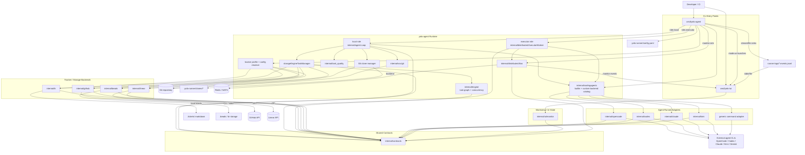

# Architecture

This diagram reflects the current detailed runtime architecture.

```mermaid
flowchart TB
  User["Developer / CI"]
  GitRepo[(Git repository)]
  RepoConfig[".yolo-runner/config.yaml"]
  CloneRoots[".yolo-runner/clones/*"]
  EventLogs["runner-logs/*.events.jsonl"]
  TicketFiles[".tickets/ markdown"]
  BeadsState[".beads / br storage"]
  GitHubAPI[(GitHub API)]
  LinearAPI[(Linear API)]
  BusInfra[(Redis / NATS)]
  AgentProcesses["External agent CLIs<br/>OpenCode / Codex / Claude / Kimi / Gemini"]

  subgraph CLIs["CLI Entry Points"]
    YoloAgent["cmd/yolo-agent"]
    YoloTUI["cmd/yolo-tui"]
  end

  subgraph Shared["Shared Contracts"]
    Contracts["internal/contracts"]
  end

  subgraph AgentRuntime["yolo-agent Runtime"]
    ProfileResolver["tracker profile + config resolver"]
    Catalog["internal/codingagents<br/>builtin + custom backend catalog"]
    LocalLoop["local role<br/>internal/agent.Loop"]
    StorageMgr["storageEngineTaskManager"]
    Engine["internal/engine<br/>task graph + concurrency"]
    Quality["internal/task_quality"]
    CloneManager["Git clone manager"]
    VCS["internal/vcs/git"]
    Executor["executor role<br/>internal/distributed.ExecutorWorker"]
    Bus["internal/distributed.Bus"]
  end

  subgraph Storage["Tracker / Storage Backends"]
    TK["internal/tk"]
    GitHubBackend["internal/github"]
    LinearBackend["internal/linear"]
    Beads["internal/beads"]
  end

  subgraph Runners["Agent Runner Adapters"]
    OpenCode["internal/opencode"]
    Codex["internal/codex"]
    Claude["internal/claude"]
    Kimi["internal/kimi"]
    GenericCmd["generic command adapter"]
  end

  subgraph Monitoring["Monitoring / UI State"]
    MonitorModel["internal/ui/monitor"]
  end

  User --> YoloAgent
  User --> YoloTUI

  YoloAgent --> RepoConfig
  YoloAgent --> ProfileResolver
  YoloAgent --> Catalog
  YoloAgent -- role=local --> LocalLoop
  YoloAgent -- role=executor --> Executor
  YoloAgent -- mode=ui launches --> YoloTUI
  YoloAgent -- stream/file sinks --> EventLogs
  YoloAgent -- monitor sink --> Bus

  ProfileResolver --> TK
  ProfileResolver --> GitHubBackend
  ProfileResolver --> LinearBackend
  ProfileResolver --> Beads

  LocalLoop --> StorageMgr
  LocalLoop --> Quality
  LocalLoop --> CloneManager
  LocalLoop --> VCS
  LocalLoop --> Catalog

  StorageMgr --> Engine
  StorageMgr --> TK
  StorageMgr --> GitHubBackend
  StorageMgr --> LinearBackend
  StorageMgr --> Beads

  Catalog --> OpenCode
  Catalog --> Codex
  Catalog --> Claude
  Catalog --> Kimi
  Catalog --> GenericCmd

  OpenCode --> AgentProcesses
  Codex --> AgentProcesses
  Claude --> AgentProcesses
  Kimi --> AgentProcesses
  GenericCmd --> AgentProcesses

  Executor --> Bus
  Executor --> Catalog

  Bus -- backend --> BusInfra

  YoloTUI --> MonitorModel
  EventLogs -- stdin/file --> YoloTUI
  Bus -- monitor events --> YoloTUI

  TK -- local tickets --> TicketFiles
  Beads -- CLI / state --> BeadsState
  GitHubBackend -- API --> GitHubAPI
  LinearBackend -- API --> LinearAPI
  CloneManager --> CloneRoots
  CloneManager --> GitRepo
  VCS --> GitRepo

  LocalLoop --> Contracts
  StorageMgr --> Contracts
  Engine --> Contracts
  Executor --> Contracts
  TK --> Contracts
  GitHubBackend --> Contracts
  LinearBackend --> Contracts
  Beads --> Contracts
  OpenCode --> Contracts
  Codex --> Contracts
  Claude --> Contracts
  Kimi --> Contracts
  MonitorModel --> Contracts
  Bus --> Contracts
```
