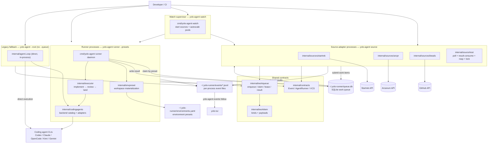
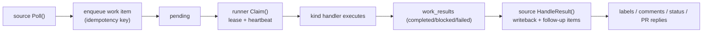
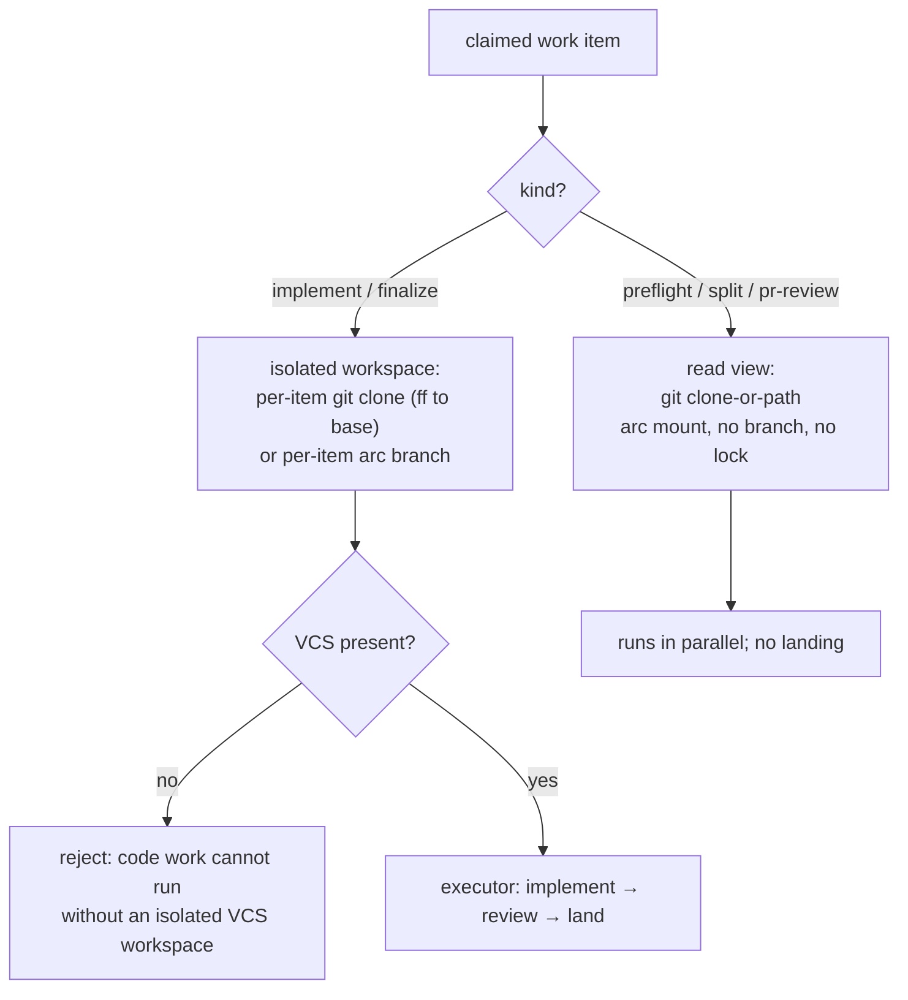
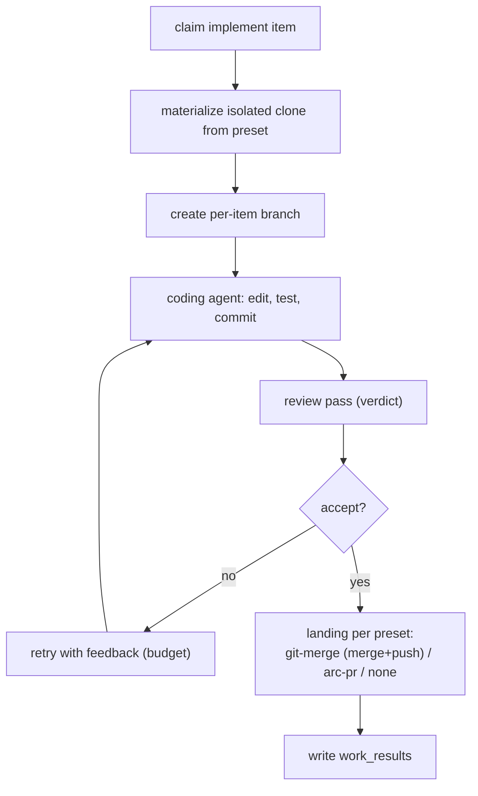
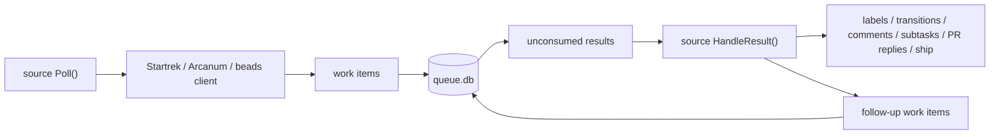
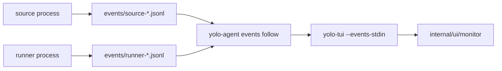

# Architecture

This document reflects the current runtime architecture: a queue-centric split
into **source-adapter** runtimes and **runner** runtimes coordinated through a
durable local SQLite work queue. They can run as separate operator-managed
processes, or under the `yolo-agent watch` supervisor. There is no network bus — the earlier
NATS/Redis "distributed" mode was removed. The project ships two binaries:
`yolo-agent` (multi-command) and `yolo-tui`.

## Top-Level Runtime

```mermaid
flowchart TB
  User["Developer / CI"]
  Queue[("~/.yolo-runner/queue.db<br/>SQLite work queue")]
  Presets["~/.yolo-runner/environments.yaml<br/>environment presets"]
  Events["~/.yolo-runner/events/*.jsonl<br/>per-process event files"]
  GitHubAPI[(GitHub API)]
  StartrekAPI[(Startrek API)]
  ArcanumAPI[(Arcanum API)]
  AgentCLIs["Coding agent CLIs<br/>Codex / Claude / OpenCode / Kimi / Gemini"]

  subgraph Sources["Source-adapter processes — yolo-agent source <name>"]
    SrcStartrek["internal/sources/startrek"]
    SrcArcpr["internal/sources/arcpr"]
    SrcBeads["internal/sources/beads"]
    SourceHost["internal/sourcehost<br/>poll + result-consume + reap + lock"]
  end

  subgraph WatchProc["Watch supervisor — yolo-agent watch"]
    Watch["cmd/yolo-agent watch<br/>start sources + autoscale pools"]
  end

  subgraph RunnerProcs["Runner processes — yolo-agent runner --presets <p>"]
    Daemon["cmd/yolo-agent runner daemon"]
    Materialize["internal/envpreset<br/>workspace materialization"]
    Executor["internal/executor<br/>implement → review → land"]
    Catalog["internal/codingagents<br/>backend catalog + adapters"]
  end

  subgraph LegacyProc["Legacy fallback — yolo-agent --root <id> (no --queue)"]
    Loop["internal/agent.Loop (direct, in-process)"]
  end

  subgraph Shared["Shared contracts"]
    Contracts["internal/contracts<br/>Event / AgentRunner / VCS"]
    WorkItem["internal/workitem<br/>kinds + payloads"]
    WorkQueue["internal/workqueue<br/>enqueue / claim / lease / result"]
  end

  User --> Sources
  User --> WatchProc
  User --> RunnerProcs
  User --> LegacyProc
  WatchProc --> Sources
  WatchProc --> RunnerProcs

  SrcStartrek --> StartrekAPI
  SrcArcpr --> ArcanumAPI
  SrcBeads --> GitHubAPI
  Sources -- submit work items --> Queue
  Queue -- typed results --> Sources

  Daemon -- claim by preset --> Queue
  Daemon -- write result --> Queue
  Daemon --> Materialize
  Daemon --> Executor
  Materialize --> Presets
  Executor --> Catalog
  Catalog --> AgentCLIs

  Loop --> Catalog
  Loop -- direct execution --> AgentCLIs

  Sources --> Events
  RunnerProcs --> Events
  LegacyProc --> Events
  Events -- yolo-agent events follow --> TUI["yolo-tui"]

  Sources --> Contracts
  RunnerProcs --> Contracts
  Sources --> WorkQueue
  RunnerProcs --> WorkQueue
  WorkQueue --> WorkItem
```

## Work Item Lifecycle

Sources discover work in their external system and submit typed work items;
runners claim them by preset, execute by kind, and write a typed result the
source consumes and writes back.

```mermaid
flowchart LR
  Discover["source Poll()"] --> Submit["enqueue work item<br/>(idempotency key)"]
  Submit --> Pending["pending"]
  Pending --> Claim["runner Claim()<br/>lease + heartbeat"]
  Claim --> Run["kind handler executes"]
  Run --> Result["work_results (completed/blocked/failed)"]
  Result --> Consume["source HandleResult()<br/>writeback + follow-up items"]
  Consume --> Tracker["labels / comments / status / PR replies"]
```

Work kinds: `implement`, `review`, `preflight`, `split`, `pr-review`,
`finalize`. A stale lease (runner crash) is requeued with backoff, then failed
with a synthesized result so the source always gets an answer. Admission is
idempotent (unique idempotency key); writebacks are idempotent.

## Kind-Aware Isolation

The runner isolates by work kind, not by a preset flag. Code-writing kinds
always run in a fresh isolated, VCS-bearing workspace; read-only kinds get a
lightweight parallel-safe read view.

```mermaid
flowchart TB
  Item["claimed work item"] --> Kind{"kind?"}
  Kind -->|implement / finalize| Iso["isolated workspace:<br/>per-item git clone (ff to base)<br/>or per-item arc branch"]
  Kind -->|preflight / split / pr-review| Read["read view:<br/>git clone-or-path<br/>arc mount, no branch, no lock"]
  Iso --> Guard{"VCS present?"}
  Guard -->|no| Reject["reject: code work cannot run<br/>without an isolated VCS workspace"]
  Guard -->|yes| Exec["executor: implement → review → land"]
  Read --> Parallel["runs in parallel; no landing"]
```

## Runner Execution (implement kind)

```mermaid
flowchart TB
  Claim["claim implement item"] --> Mat["materialize isolated clone from preset"]
  Mat --> Branch["create per-item branch"]
  Branch --> Impl["coding agent: edit, test, commit"]
  Impl --> Review["review pass (verdict)"]
  Review --> Gate{"accept?"}
  Gate -->|no| Retry["retry with feedback (budget)"]
  Retry --> Impl
  Gate -->|yes| Land["landing per preset:<br/>git-merge (merge+push) / arc-pr / none"]
  Land --> ResultRow["write work_results"]
```

## Source Adapters

Sources own all tracker semantics; runners never see a Startrek label or an
Arcanum comment. `internal/sourcehost` provides the shared runtime (resilient
poll loop, result consumption, opportunistic lease reaping, singleton flock,
per-process event file). The Startrek chain is expressed as work-item chains:
`preflight` result → (needs-info comment | submit `split`) → `split` result →
create subtasks + submit `implement` items → `implement` result → status/labels
+ optional `finalize` (epic PR).

```mermaid
flowchart LR
  Poll["source Poll()"] --> ST["Startrek / Arcanum / beads client"]
  ST --> Items["work items"]
  Items --> Q[("queue.db")]
  Q --> Results["unconsumed results"]
  Results --> HR["source HandleResult()"]
  HR --> Writeback["labels / transitions / comments / subtasks / PR replies / ship"]
  HR --> Followups["follow-up work items"]
  Followups --> Q
```

## Monitoring And Event Flow

Each process appends JSONL to its own `~/.yolo-runner/events/<proc>.jsonl`
file. `yolo-agent events follow` merge-tails them by timestamp into the
unchanged `yolo-tui` stdin protocol. Events carry optional `proc` and `item_id`
fields so a multi-process run can be grouped in the UI.

`yolo-agent watch --tui` uses the same event protocol but launches `yolo-tui`
for the operator. `--stream` keeps NDJSON on stdout for pipes and service logs.

```mermaid
flowchart LR
  SourceProc["source process"] --> F1["events/source-*.jsonl"]
  RunnerProc["runner process"] --> F2["events/runner-*.jsonl"]
  F1 --> Follow["yolo-agent events follow"]
  F2 --> Follow
  Follow --> TUI["yolo-tui --events-stdin"]
  TUI --> Monitor["internal/ui/monitor"]
```

## Watch Supervisor

`yolo-agent watch` reads the `watch:` block in `.yolo-runner/config.yaml`,
starts all configured `startrek` and `arcpr` sources in-process, and manages
runner pools with `min_replicas`, `max_replicas`, and `capacity`. Autoscaling is
queue-depth based per pool and bounded by `watch.autoscale.min_runners` and
`watch.autoscale.max_runners`.

The supervisor does not replace queue claim limits. Preset-level
`limits.max_concurrent` still comes from the environment preset and remains the
final concurrency gate at claim time. This lets one Startrek profile watch many
queues while each queue routes to the preset that owns its workspace and limits.

## Legacy Direct Path

The single-command `yolo-agent --repo . --root <id> --profile <name>` (without
`--queue`) still runs the in-process `internal/agent.Loop`, which clones per
task and lands directly. It is retained as a proven fallback. Adding `--queue`
switches the same command to submit `implement` items to the queue; if no
standalone runner is live it starts an embedded runner that clones the repo per
item (it never executes in the live working tree). `tracker-watch` and
`arc-review-watch` remain as deprecated compatibility shims over
`source startrek` and `source arcpr`.

## Where Prompting Lives

Task state, retries, and status transitions stay in code. Prompts are used only
where model judgement is valuable: implementation, review, preflight, splitting,
and PR review. The split between "code decides, model judges" is preserved
across the queue boundary — sources interpret typed results, runners run
prompts.
