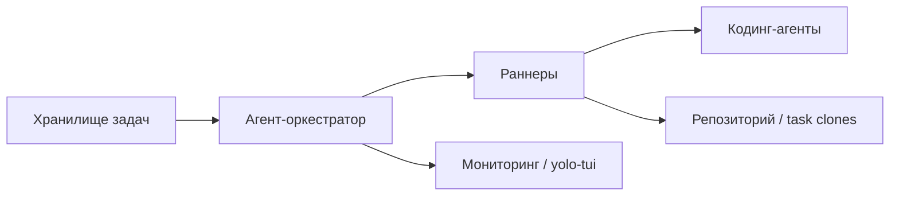

---
layout: cover
background: radial-gradient(circle at top left, rgba(109,91,208,0.18), transparent 28%), radial-gradient(circle at top right, rgba(47,143,91,0.14), transparent 24%), linear-gradient(180deg, #fbfaf7 0%, #f3efe6 100%)
class: text-left
---

Черновик доклада

YOLO Runner

Как я собираю себе систему для долгой автономной работы кодинг-агентов:
через задачи в трекере, оркестратор и раннеры.

Предварительная версия на основе <code>keynote.md</code>.

---

# Кто я

  <h3>Заготовка для короткого интро</h3>
  <ul class="soft-list">
    <li><b>[Имя, команда, роль]</b></li>
    <li>[Чем занимаетесь в обычной жизни]</li>
    <li>[Почему вам вообще понадобилась такая система]</li>
  </ul>

Сюда можно вставить короткую подводку на 20-30 секунд, когда появится финальный контекст выступления.

---
layout: section
---

# Зачем это всё

---

# Проблема

  

    <h3>Дефицит внимания</h3>
    
Постоянное переключение между окнами и задачами ломает фокус и мешает возвращаться к важному.

  

  

    <h3>Слишком много ручного контроля</h3>
    
Нужно бесконечно подтверждать, уточнять, принимать решения и держать всё в голове.

  

  

    <h3>Ночные лимиты простаивают</h3>
    
Дорогие и полезные токены есть, но они не превращаются в длинную автономную работу.

  

---

# Мои интересы очень специфичны

  

    <h3>Долгая работа без меня</h3>
    
Хочется, чтобы система продолжала двигаться по задачам, пока я сплю или занят другим.

  

  

    <h3>Контроль через трекер</h3>
    
Управление должно идти через привычные задачи и статусы, а не через отдельный чат-ритуал.

  

  

    <h3>Разные агенты</h3>
    
Нужна возможность выбирать модель, инструменты и раннер под конкретный тип работы.

  

---

# Почему не что-то готовое

  

    <h3>Мои задачи довольно нишевые</h3>
    <ul class="soft-list">
      <li>длинные автономные прогоны</li>
      <li>жесткая привязка к трекеру задач</li>
      <li>несколько типов раннеров и агентов</li>
    </ul>
  

  

    <h3>Это еще и учебный проект</h3>
    <ul class="soft-list">
      <li>понять, как устроены такие системы внутри</li>
      <li>пощупать реальные ограничения и компромиссы</li>
      <li>собрать свой слой управления поверх агентов</li>
    </ul>
  

---
layout: section
---

# Как это устроено

---

# Три главные части

  

    <h3>Хранилище задач</h3>
    
Хранит задачи, статусы и связи между ними.

  

  

    <h3>Агент-оркестратор</h3>
    
Получает текущее состояние, выбирает runnable-задачи и управляет исполнением.

  

  

    <h3>Раннеры</h3>
    
Запускают конкретных кодинг-агентов и доводят выполнение до результата.

  

---

# Верхнеуровневая схема

---

# Хранилище задач

  

    <h3>Что оно хранит</h3>
    <ul class="soft-list">
      <li>сами задачи</li>
      <li>статусы</li>
      <li>родительские связи</li>
      <li>зависимости между задачами</li>
    </ul>
  

  

    <h3>Зачем это важно</h3>
    <ul class="soft-list">
      <li>можно запускать только то, что действительно готово к выполнению</li>
      <li>можно управлять всем через привычный трекер</li>
      <li>система не живет отдельной жизнью от задач</li>
    </ul>
  

В текущей реализации это могут быть TK, GitHub, Linear, beads/br.

---

# Агент-оркестратор

  <ul class="soft-list">
    <li>получает текущее дерево задач</li>
    <li>решает, что можно запускать прямо сейчас</li>
    <li>раздает задачи раннерам в нужном порядке</li>
    <li>контролирует прогресс, логи, проверки и завершение работы</li>
  </ul>

Именно здесь живет вся логика «что делать дальше».

---

# Раннер

  

    <h3>Что делает</h3>
    <ul class="soft-list">
      <li>запускает backend кодинг-агента</li>
      <li>общается через ACP, CLI или app server</li>
      <li>выполняет задачу в рабочей копии репозитория</li>
    </ul>
  

  

    <h3>Что для меня важно</h3>
    <ul class="soft-list">
      <li>можно подменять модель и инструменты</li>
      <li>можно делать YOLO-режим там, где это уместно</li>
      <li>можно сравнивать поведение разных агентов</li>
    </ul>
  

---
layout: section
---

# Что самое важное

---

# Что реально влияет на качество

  

    <h3>Размер и формулировка задач</h3>
    
Если задача слишком большая, слишком расплывчатая или плохо декомпозирована, агент почти неизбежно начнет ошибаться.

  

  

    <h3>Среда и инструменты</h3>
    
Качество зависит не только от модели, но и от доступа к коду, тестам, git, логам и понятному контуру выполнения.

  

Модель важна. Но плохая задача и плохая среда ломают результат быстрее, чем выбор бренда модели.

---
layout: section
---

# Что дальше

---

# Roadmap

  

    <h3>Больше раннеров</h3>
    <ul class="soft-list">
      <li>разные модели</li>
      <li>разные инструменты</li>
      <li>разные execution profiles</li>
    </ul>
  

  

    <h3>Распределенное выполнение</h3>
    <ul class="soft-list">
      <li>подключение раннеров по сети</li>
      <li>параллельная работа на отдельных машинах</li>
    </ul>
  

  

    <h3>Безопасность</h3>
    <ul class="soft-list">
      <li>усиление sandbox-модели</li>
      <li>возможно контейнеризация</li>
      <li>более аккуратная передача секретов</li>
    </ul>
  

  

    <h3>Оргмодель</h3>
    <ul class="soft-list">
      <li>BYOT / shared ownership</li>
      <li>использование не только для одного проекта</li>
    </ul>
  

---
layout: center
class: text-center
---

# Спасибо

### Вопросы, идеи, возражения

Следующий шаг для этого черновика: добавить один живой кейс, короткое демо и финальный слайд «что уже работает сегодня».

