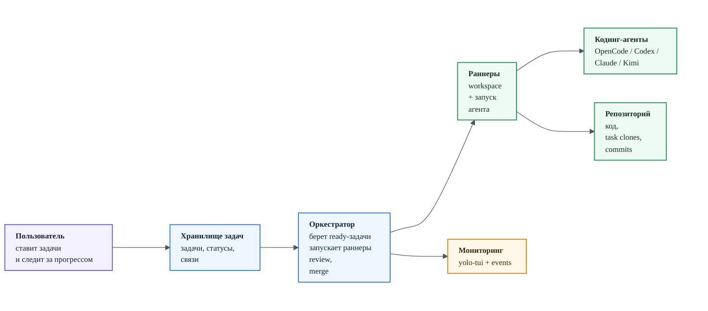
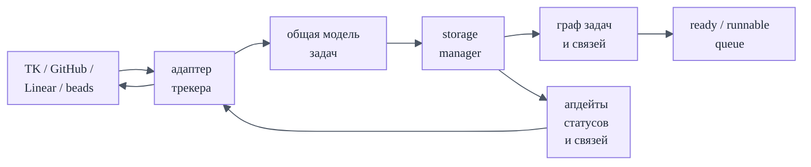
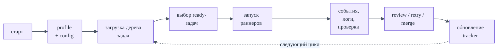
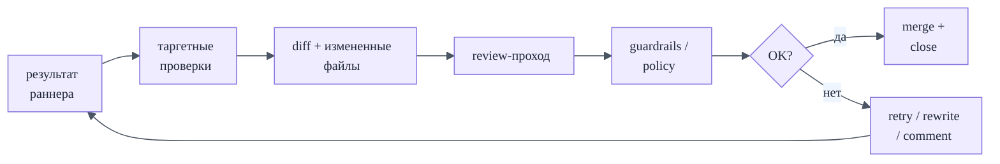
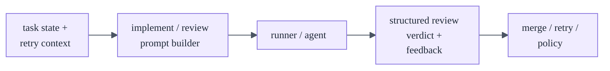
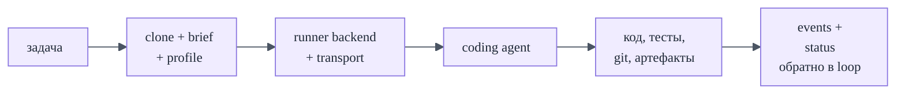
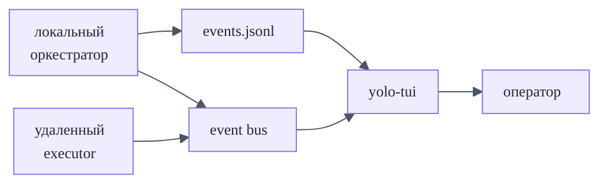

<style>
:root {
  --yr-ink: #1f2937;
  --yr-muted: #5b6473;
  --yr-purple: #6d5bd0;
  --yr-blue: #3f7ad6;
  --yr-green: #2f8f5b;
  --yr-gold: #c38a1b;
  --yr-cream: #faf8f2;
}

.slidev-layout {
  color: var(--yr-ink);
  background: var(--yr-cream);
}

.slidev-layout h1,
.slidev-layout h2,
.slidev-layout h3 {
  letter-spacing: -0.02em;
}

.slidev-layout h3 {
  font-size: 1.22rem;
  line-height: 1.18;
}

.deck-kicker {
  display: inline-block;
  margin-bottom: 1rem;
  padding: 0.25rem 0.7rem;
  border: 1px solid rgba(109, 91, 208, 0.35);
  border-radius: 999px;
  font-size: 0.85rem;
  color: var(--yr-purple);
  background: rgba(109, 91, 208, 0.08);
}

.hero-title {
  font-size: 3.1rem;
  line-height: 1;
  font-weight: 700;
  margin: 0.3rem 0 0.8rem;
  color: var(--yr-ink);
}

.hero-subtitle {
  font-size: 1.25rem;
  line-height: 1.35;
  max-width: 42rem;
  color: var(--yr-ink);
}

.muted {
  color: var(--yr-muted);
}

.card-grid {
  display: grid;
  gap: 1rem;
  margin-top: 1.25rem;
}

.grid-2 {
  grid-template-columns: repeat(2, minmax(0, 1fr));
}

.grid-3 {
  grid-template-columns: repeat(3, minmax(0, 1fr));
}

.idea-card {
  padding: 1rem 1.1rem;
  border-radius: 18px;
  background: rgba(255, 255, 255, 0.74);
  border: 1px solid rgba(31, 41, 55, 0.12);
  box-shadow: 0 10px 30px rgba(31, 41, 55, 0.06);
}

.idea-card h3,
.idea-card h4 {
  margin: 0 0 0.6rem;
  font-size: 1.18rem;
  line-height: 1.16;
}

.idea-card p,
.idea-card li {
  font-size: 0.96rem;
  line-height: 1.35;
}

.compact-card {
  padding: 0.85rem 0.95rem;
  font-size: 0.9rem;
}

.compact-card h3 {
  margin-bottom: 0.45rem;
  font-size: 1.06rem;
}

.idea-card ul {
  margin: 0;
  padding-left: 1.1rem;
}

.idea-card li + li {
  margin-top: 0.35rem;
}

.accent-purple {
  border-color: rgba(109, 91, 208, 0.3);
  background: linear-gradient(180deg, rgba(109, 91, 208, 0.09), rgba(255, 255, 255, 0.78));
}

.accent-blue {
  border-color: rgba(63, 122, 214, 0.3);
  background: linear-gradient(180deg, rgba(63, 122, 214, 0.08), rgba(255, 255, 255, 0.78));
}

.accent-green {
  border-color: rgba(47, 143, 91, 0.3);
  background: linear-gradient(180deg, rgba(47, 143, 91, 0.08), rgba(255, 255, 255, 0.78));
}

.accent-gold {
  border-color: rgba(195, 138, 27, 0.32);
  background: linear-gradient(180deg, rgba(195, 138, 27, 0.09), rgba(255, 255, 255, 0.78));
}

.big-line {
  font-size: 1.35rem;
  line-height: 1.45;
  max-width: 46rem;
}

.mini-note {
  margin-top: 0.9rem;
  font-size: 0.92rem;
  color: var(--yr-muted);
}

.soft-list li + li {
  margin-top: 0.45rem;
}

.prompt-card pre {
  margin: 0;
  padding: 0.9rem 1rem;
  border-radius: 16px;
  background: rgba(31, 41, 55, 0.94);
  color: #f9fafb;
  font-size: 0.72rem;
  line-height: 1.35;
  overflow: hidden;
}

.tight-list li + li {
  margin-top: 0.3rem;
}

.cover-shell {
  display: grid;
  grid-template-columns: minmax(0, 1.35fr) minmax(18rem, 0.85fr);
  gap: 1.8rem;
  align-items: end;
  margin-top: -1.6rem;
}

.cover-main {
  padding-top: 0.6rem;
}

.cover-pills {
  display: flex;
  flex-wrap: wrap;
  gap: 0.55rem;
  margin-top: 1.15rem;
}

.cover-pill {
  display: inline-flex;
  align-items: center;
  padding: 0.36rem 0.72rem;
  border-radius: 999px;
  font-size: 0.82rem;
  color: var(--yr-ink);
  background: rgba(255, 255, 255, 0.72);
  border: 1px solid rgba(31, 41, 55, 0.12);
}

.slidev-layout.cover .cover-panel {
  padding: 1.15rem 1.2rem;
  border-radius: 24px;
  background: linear-gradient(180deg, rgba(255, 255, 255, 0.86), rgba(255, 255, 255, 0.62));
  border: 1px solid rgba(109, 91, 208, 0.18);
  box-shadow: 0 18px 40px rgba(31, 41, 55, 0.08);
  color: var(--yr-ink) !important;
}

.slidev-layout.cover .cover-panel h3 {
  margin: 0 0 0.7rem;
  font-size: 1.08rem;
  color: var(--yr-ink) !important;
}

.slidev-layout.cover .cover-panel ul {
  margin: 0;
  padding-left: 1.1rem;
  color: var(--yr-ink) !important;
}

.slidev-layout.cover .cover-panel li {
  color: var(--yr-ink) !important;
}

.cover-caption {
  margin-top: 0.9rem;
  font-size: 0.9rem;
  color: var(--yr-muted);
}

.mermaid {
  font-size: 0.82rem;
}

.mermaid svg {
  max-width: 100%;
  height: auto;
}

.mermaid :is(foreignObject div, .label, .nodeLabel) {
  font-size: 0.78rem !important;
  line-height: 1.12 !important;
}

.qr-panel {
  display: flex;
  align-items: center;
  justify-content: center;
  flex-wrap: wrap;
  gap: 1.4rem;
  margin-top: 1.8rem;
}

.qr-card {
  padding: 0.9rem;
  border-radius: 20px;
  background: rgba(255, 255, 255, 0.9);
  border: 1px solid rgba(31, 41, 55, 0.12);
  box-shadow: 0 10px 30px rgba(31, 41, 55, 0.08);
}

.repo-qr {
  display: block;
  width: 10.5rem;
  height: 10.5rem;
}

.repo-link-block {
  max-width: 18rem;
  text-align: left;
}

.repo-link {
  font-size: 1.05rem;
  line-height: 1.3;
  word-break: break-word;
}

.repo-link a {
  color: var(--yr-purple);
  text-decoration: none;
}
</style>

<div class="cover-shell"><div class="cover-main"><div class="deck-kicker">Оркестрация кодинг-агентов</div><div class="hero-title">YOLO Runner</div><div class="hero-subtitle">Как я собираю себе control plane для долгой автономной работы кодинг-агентов: через задачи в трекере, оркестратор, раннеры и жесткие гардрейлы.</div><div class="cover-pills"><span class="cover-pill">tracker-first</span><span class="cover-pill">review + guardrails</span><span class="cover-pill">multi-runner</span><span class="cover-pill">hackathon ideas inside</span></div></div><div class="cover-panel accent-purple"><h3>Внутри</h3><ul class="soft-list tight-list"><li>почему chat-first loop перестал хватать</li><li>архитектура: tracker, orchestrator, runners</li><li>review, prompts и guardrails</li><li>идеи, которые можно утащить себе</li></ul><div class="cover-caption">Не про «еще один AI chat», а про слой управления длинной работой агентов.</div></div></div>

---

# Репозиторий

<div class="qr-panel">
  <div class="qr-card">
    
  </div>
  <div class="repo-link-block">
    <div class="deck-kicker">Сканируйте сразу</div>
    <div class="repo-link"><a href="https://github.com/egv/yolo-runner" target="_blank">github.com/egv/yolo-runner</a></div>
    <div class="mini-note">Код, README и текущий статус проекта лежат в репозитории.</div>
  </div>
</div>

---

# Кто я

<div class="idea-card accent-purple">
  <h3>Заготовка для короткого интро</h3>
  <ul class="soft-list">
    <li><b>Гена Евстратов</b></li>
    <li>работаю в сфере ИИ</li>
    <li>вне работы тоже делаю ИИ, потому что недостаёт естественного</li>
  </ul>
</div>

<div class="mini-note">
из-за дичайшего FOMO захотел сделать свой харнесс
</div>

---
layout: section
---

# Зачем это всё

---

# Проблема, которую я реально хотел решить

<div class="card-grid grid-3">
  <div class="idea-card accent-purple">
    <h3>Агент полезен, но живет короткими сессиями</h3>
    <p>Без отдельного control plane каждая длинная задача распадается на пачку ручных возвратов в чат и повторное восстановление контекста.</p>
  </div>
  <div class="idea-card accent-blue">
    <h3>Управление живет у меня в голове</h3>
    <p>Статусы, зависимости, кто что уже сделал и что еще надо проверить не должны существовать только в памяти оператора.</p>
  </div>
  <div class="idea-card accent-green">
    <h3>Пока меня нет, система простаивает</h3>
    <p>Ночные лимиты и параллельный compute почти не используются, если каждое следующее действие требует моего ручного пинка.</p>
  </div>
</div>

<div class="mini-note">То есть мне был нужен не просто еще один чат с агентом, а рабочий слой оркестрации для длинного цикла разработки.</div>

---

# Требования, которые я себе поставил

<div class="card-grid grid-3">
  <div class="idea-card accent-gold">
    <h3>Tracker-first</h3>
    <p>Задачи, статусы и зависимости должны жить в привычном трекере, а не в отдельном закрытом UI.</p>
  </div>
  <div class="idea-card accent-blue">
    <h3>Долгая работа без меня</h3>
    <p>Система должна уметь сама брать ready-задачи и двигаться дальше, пока я сплю или занят другим.</p>
  </div>
  <div class="idea-card accent-green">
    <h3>Несколько раннеров</h3>
    <p>Нужно легко менять модель, тулы, execution profile и тип раннера под конкретную задачу.</p>
  </div>
  <div class="idea-card accent-purple">
    <h3>Восстановимость</h3>
    <p>После падения или остановки должно быть понятно, что уже произошло, что завершилось и что можно безопасно продолжать.</p>
  </div>
  <div class="idea-card accent-gold">
    <h3>Жесткие гардрейлы</h3>
    <p>Git, ревью, тесты и переходы статусов должны быть ограничены политикой, а не свободной импровизацией модели.</p>
  </div>
  <div class="idea-card accent-blue">
    <h3>Наблюдаемость</h3>
    <p>Нужны события, логи и понятный мониторинг, чтобы я видел систему целиком, а не гадал, что там происходит.</p>
  </div>
</div>

---

# Что я пробовал до этого

<div class="card-grid grid-3">
  <div class="idea-card accent-purple">
    <h3>Обычный chat-first loop</h3>
    <p><b>Нравится:</b> очень низкий порог входа, быстрый старт.</p>
    <p><b>Не нравится:</b> плохо держит длинную очередь задач и почти всегда требует постоянного babysitting.</p>
  </div>
  <div class="idea-card accent-blue">
    <h3>Ad-hoc скрипты и automation</h3>
    <p><b>Нравится:</b> детерминированность и предсказуемость.</p>
    <p><b>Не нравится:</b> быстро упирается в бедный контекст, слабое ревью и жесткую ручную интеграцию с репозиторием.</p>
  </div>
  <div class="idea-card accent-green">
    <h3>Чужие идеи оркестрации</h3>
    <p><b>Нравится:</b> там очень много хороших паттернов, которые можно украсть.</p>
    <p><b>Не нравится:</b> подгонять их под tracker-first workflow, мои гардрейлы и мой набор агентов оказалось дороже, чем собрать тонкий свой слой.</p>
  </div>
</div>

<div class="mini-note">Это не хейт на готовые решения. Наоборот: большая часть хороших идей в таких системах переиспользуется, просто не всегда в исходной форме.</div>

---

# Почему в итоге я пошел в NIH

<div class="card-grid grid-3">
  <div class="idea-card accent-purple">
    <h3>Не ради платформы</h3>
    <p>Я не хотел строить новый большой продукт. Мне нужен был рабочий control plane для моего способа разработки.</p>
  </div>
  <div class="idea-card accent-blue">
    <h3>Мне важна inspectability</h3>
    <p>Я хочу сам видеть статусы, prompts, policy, git-следы, review-решения и понимать, почему система приняла именно такое решение.</p>
  </div>
  <div class="idea-card accent-green">
    <h3>Цена кастомизации оказалась ниже</h3>
    <p>В моем случае оказалось проще написать тонкий orchestration layer вокруг агентов, чем ломать свои ограничения об чужую abstraction.</p>
  </div>
</div>

<div class="mini-note">Для меня NIH здесь не про «переписать всё», а про «держать собственными руками слой принятия решений и гардрейлов».</div>

---
layout: section
---

# Как это устроено

---

# Три главные части

<div class="card-grid grid-3">
  <div class="idea-card accent-blue">
    <h3>Хранилище задач</h3>
    <p>Хранит задачи, статусы и связи между ними.</p>
  </div>
  <div class="idea-card accent-purple">
    <h3>Агент-оркестратор</h3>
    <p>Получает текущее состояние, выбирает runnable-задачи и управляет исполнением.</p>
  </div>
  <div class="idea-card accent-green">
    <h3>Раннеры</h3>
    <p>Запускают конкретных кодинг-агентов и доводят выполнение до результата.</p>
  </div>
</div>

---

# Верхнеуровневая схема



---

# Хранилище задач: как работает поток



<div class="mini-note">Идея простая: какой бы трекер ни стоял под капотом, оркестратор видит одну и ту же нормализованную модель задач.</div>

---

# Агент-оркестратор: цикл работы



<div class="mini-note">Именно здесь живет логика «что запускать дальше», «кого перезапустить» и «когда задачу можно закрыть».</div>

---

# Что происходит на этапе ревью



<div class="mini-note">Сначала детерминированные проверки, потом judgement, и только в конце изменение статуса. Это сильно снижает хаос.</div>

---

# Где тут вообще живут промпты



<div class="mini-note">Для этого доклада важен именно prompt builder в <code>internal/agent/loop.go</code>: он собирает implementation/review prompts из режима, состояния задачи и retry-контекста.</div>

---
layout: two-cols
---

# Реальный implement prompt из кода

```text
Command Contract:
- Work only on this task; do not switch tasks.
- Do not call task-selection/status tools
  (the runner owns task state).
- Keep edits scoped to files required
  for this task.

Strict TDD Checklist:
[ ] Add or update a test that fails
    for the target behavior.
[ ] Run the targeted test and confirm
    it fails before implementation.
[ ] Implement the minimal code change
    required for the test to pass.
```

<div class="mini-note">Источник: <code>internal/agent/loop.go</code>, функция <code>buildPrompt</code>.</div>

::right::

<div class="idea-card accent-gold">
  <h3>Что здесь важно</h3>
  <ul class="soft-list tight-list">
    <li>это не моя интерпретация, а реальный excerpt из <code>buildPrompt</code></li>
    <li>runner явно забирает себе task selection и status management</li>
    <li>scope control и tests-first зашиты прямо в prompt contract</li>
    <li>по коду видно, что при включенном TDD mode checklist заменяется на еще более жесткий Red-Green-Refactor workflow</li>
  </ul>
</div>

---
layout: two-cols
---

# Реальный review prompt из кода

```text
Review Instructions:
- Include exactly one verdict line in this format:
  REVIEW_VERDICT: pass OR REVIEW_VERDICT: fail
- Use pass only when implementation satisfies
  acceptance criteria and tests.
- If fail, include exactly one structured line:
  REVIEW_FAIL_FEEDBACK: <blocking gaps and fixes>

Verdict-only follow-up:
- Respond with exactly one line and no extra text:
  REVIEW_VERDICT: pass
  or
  REVIEW_VERDICT: fail
```

<div class="mini-note">Источники: <code>internal/agent/loop.go</code>, функции <code>buildPrompt</code> и <code>buildReviewVerdictPrompt</code>.</div>

::right::

<div class="idea-card accent-green compact-card">
  <h3>Что здесь важно</h3>
  <ul class="soft-list tight-list">
    <li>review здесь не prose, а structured protocol</li>
    <li>verdict и feedback нормализованы под автоматический retry-loop</li>
    <li>если reviewer не вернул verdict format, код шлет отдельный follow-up prompt</li>
    <li>это уже prompt как interface, а не просто текст для модели</li>
  </ul>
</div>

---

# Раннер: жизненный цикл задачи



<div class="mini-note">За счет этого слоя можно менять модель, набор инструментов и execution profile, не ломая весь остальной pipeline.</div>

---

# Мониторинг и распределенный режим



<div class="mini-note">Даже если задачи исполняются на других машинах, оператор продолжает смотреть на один поток событий и один мониторинг. Под капотом bus может быть Redis или NATS.</div>

---
layout: section
---

# Что можно утащить себе

---

# С чего начать на хакатоне

<div class="card-grid grid-2">
  <div class="idea-card accent-blue">
    <h3>1. Возьмите один backend задач</h3>
    <p>Не начинайте с «поддержим всё». Один tracker, одна схема статусов, один ready-queue уже дают половину системы.</p>
  </div>
  <div class="idea-card accent-purple">
    <h3>2. Захардкодьте один flow</h3>
    <p><code>ready -> run -> review -> close</code> почти всегда полезнее, чем «универсальный framework» в первый weekend.</p>
  </div>
  <div class="idea-card accent-green">
    <h3>3. Возьмите одного раннера</h3>
    <p>Один агент, один prompt, один event format. Мультиагентность стоит добавлять только после первого устойчивого прохода.</p>
  </div>
  <div class="idea-card accent-gold">
    <h3>4. Сразу делайте мониторинг</h3>
    <p>JSONL events, простая TUI или хотя бы timeline логов нужны с первого дня. Иначе вы не поймете, что ломается.</p>
  </div>
</div>

<div class="mini-note">Самая частая ошибка: начать с абстракций, а не с одного жестко работающего контура.</div>

---

# Жестко заданные flow-ы, которые реально работают

<div class="card-grid grid-2">
  <div class="idea-card accent-purple">
    <h3>Implement lane</h3>
    <p><code>task -> implement -> review -> PR/merge</code></p>
    <p>Хорошая базовая дорожка почти для любого хакатона.</p>
  </div>
  <div class="idea-card accent-blue">
    <h3>Bugfix lane</h3>
    <p><code>issue -> reproduce -> fix -> targeted tests -> close</code></p>
    <p>Лучше всего работает на узких задачах с понятным критерием done.</p>
  </div>
  <div class="idea-card accent-green">
    <h3>Cleanup / docs lane</h3>
    <p><code>task -> diff -> lint/check -> merge</code></p>
    <p>Удобный полигон, чтобы обкатать events, review и статусы без высокого риска.</p>
  </div>
  <div class="idea-card accent-gold">
    <h3>Batch backlog lane</h3>
    <p><code>ready queue -> N workers -> auto review -> human gate</code></p>
    <p>Подходит, когда уже есть уверенность в базовом контуре и хочется параллелизма.</p>
  </div>
</div>

---

# Что реально влияет на качество

<div class="card-grid grid-2">
  <div class="idea-card accent-purple">
    <h3>Размер и формулировка задач</h3>
    <p class="big-line">Если задача слишком большая, слишком расплывчатая или плохо декомпозирована, агент почти неизбежно начнет ошибаться.</p>
  </div>
  <div class="idea-card accent-green">
    <h3>Среда и инструменты</h3>
    <p class="big-line">Качество зависит не только от модели, но и от доступа к коду, тестам, git, логам и понятному контуру выполнения.</p>
  </div>
</div>

<div class="mini-note">Модель важна. Но плохая задача и плохая среда ломают результат быстрее, чем выбор бренда модели.</div>

---
layout: section
---

# Что дальше

---

# Что дальше в самом проекте

<div class="card-grid grid-2">
  <div class="idea-card accent-blue">
    <h3>Больше раннеров и профилей</h3>
    <ul class="soft-list">
      <li>разные модели</li>
      <li>разные инструменты</li>
      <li>разные execution profiles</li>
    </ul>
  </div>
  <div class="idea-card accent-green">
    <h3>Распределенное выполнение</h3>
    <ul class="soft-list">
      <li>подключение раннеров по сети</li>
      <li>параллельная работа на отдельных машинах</li>
      <li>нормальная диспетчеризация executor-ов</li>
    </ul>
  </div>
</div>

---

# Что дальше: hardening и reusable kit

<div class="card-grid grid-2">
  <div class="idea-card accent-gold">
    <h3>Безопасность и секреты</h3>
    <ul class="soft-list">
      <li>усиление sandbox-модели</li>
      <li>контейнеризация там, где она окупается</li>
      <li>более аккуратная передача секретов</li>
    </ul>
  </div>
  <div class="idea-card accent-purple">
    <h3>То, что можно превратить в kit</h3>
    <ul class="soft-list">
      <li>starter templates для хакатона</li>
      <li>набор готовых flow presets</li>
      <li>повторно используемые prompt / policy packs</li>
    </ul>
  </div>
</div>

---
layout: center
class: text-center
---

# Спасибо

### Вопросы, идеи, возражения

<div class="qr-panel">
  <div class="qr-card">
    
  </div>
  <div class="repo-link-block">
    <div class="deck-kicker">Репозиторий</div>
    <div class="repo-link"><a href="https://github.com/egv/yolo-runner" target="_blank">github.com/egv/yolo-runner</a></div>
    <div class="mini-note">Можно сканировать прямо с финального слайда.</div>
  </div>
</div>

<div class="mini-note">
Следующий шаг для этого черновика: добавить один живой кейс, короткое демо и финальный слайд «что уже работает сегодня».
</div>
